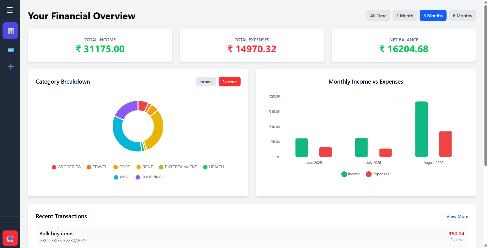
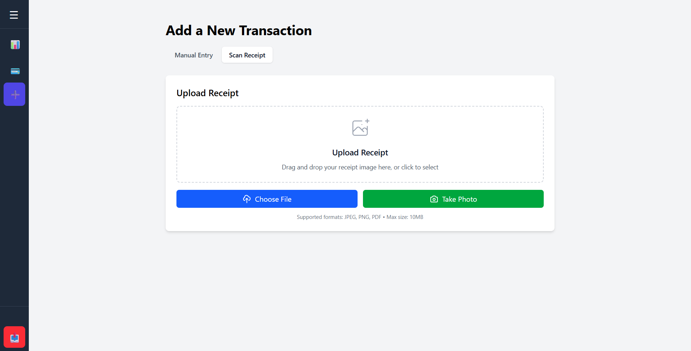
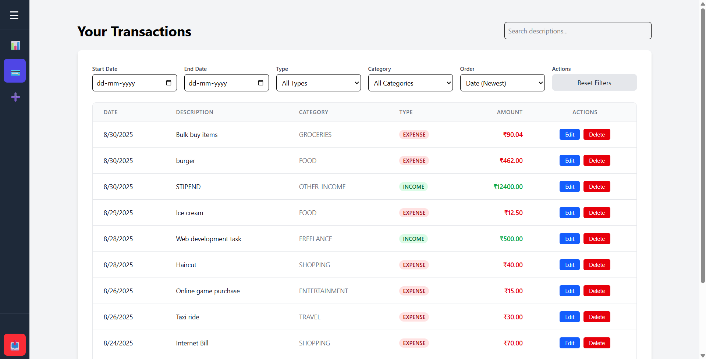

# Personal Finance Assistant 💰

A modern web application to help you track your expenses, manage transactions, and analyze your spending patterns with AI-powered receipt scanning.

## ✨ Features

- **Smart Receipt Scanning**: Upload receipts and automatically extract transaction details using AI
- **Camera Integration**: Take photos of receipts directly from your phone
- **Transaction Management**: Add, view, and categorize your income and expenses
- **Visual Analytics**: Beautiful charts showing spending patterns and category breakdowns
- **Secure Authentication**: JWT-based user authentication and authorization
- **Responsive Design**: Works seamlessly on desktop and mobile devices

## 🛠️ Tech Stack

**Frontend:**

- React 19 with Vite
- TailwindCSS for styling
- Chart.js for data visualization
- React Router for navigation
- Axios for API calls

**Backend:**

- Node.js with Express
- Prisma ORM with PostgreSQL
- JWT authentication
- Mindee API for OCR processing
- Multer for file uploads

## 📱 Screenshots

<!-- Add screenshots here -->

_Dashboard Overview_


_Receipt Upload_


_Transaction Management_


## 🚀 Live Demo

**Live Application:** https://finance-app-frontend-52wb.onrender.com

**Video:** https://github.com/vedant115/PersonalFinanceAssistant/tree/main/screenshots/Demo_Video.mp4

## 🏃‍♂️ Quick Start

### Prerequisites

- Node.js 18+
- PostgreSQL database
- Mindee API key (for receipt scanning)

### Local Development

1. **Clone the repository**

```bash
git clone <your-repo-url>
cd personal-finance-assistant
```

2. **Setup Backend**

```bash
cd backend
npm install
cp .env.example .env
npx prisma migrate dev
npm run dev
```

3. **Setup Frontend**

```bash
cd frontend
npm install
npm run dev
```

4. **Environment Variables**

Backend `.env`:

```
DATABASE_URL="your-postgresql-url"
JWT_SECRET="your-secret-key"
MINDEE_API_KEY="your-mindee-api-key"
FRONTEND_URL="http://localhost:5173"
```

Frontend `.env`:

```
API_URL="http://localhost:3000"
```

---

Made with ❤️ by Vedant Rahane
